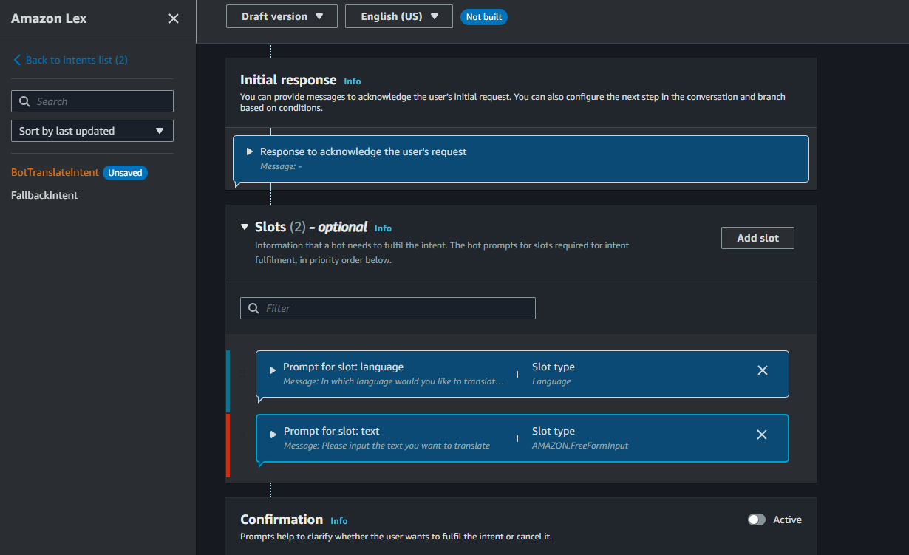
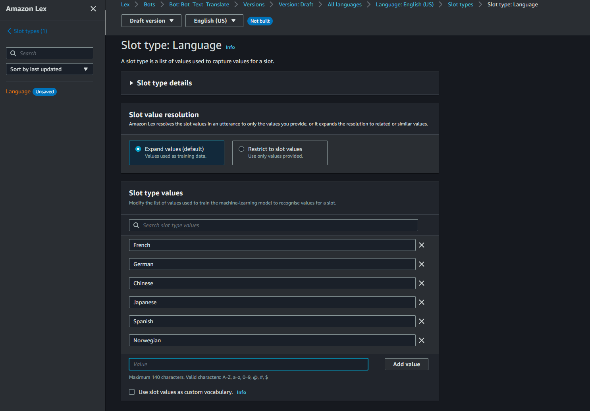
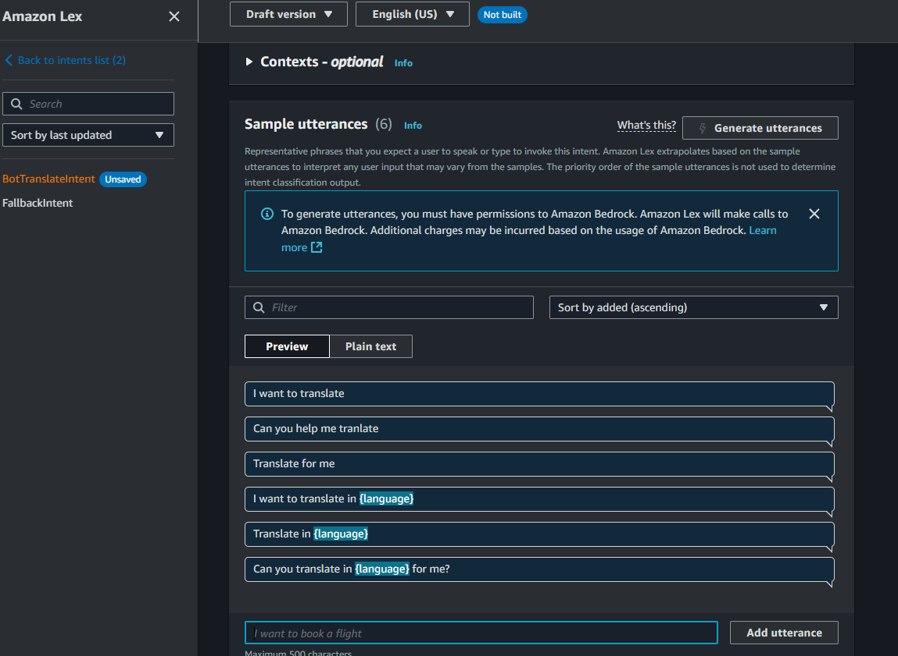
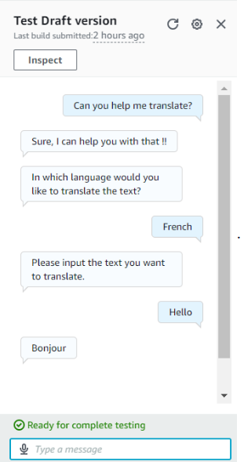

# LanguaLex
LanguaLex is an AI chatbot that translates text into different languages using Amazon Lex and Amazon Translate. Just type in a word or sentence, select a language, and let the bot do the magic!

🌍 LauguaLex - AI-Powered Translation Bot
Overview ☁️
LanguaLex is an AI chatbot that translates text into different languages using Amazon Lex and Amazon Translate. Just type in a word or sentence, select a language, and let the bot do the magic!

🚀 Steps Taken
1️⃣ Bot Configuration & IAM Role Setup
- Created the bot using Amazon Lex.
- Assigned an IAM role to ensure secure access.

  

2️⃣ Intent & Slot Setup
- Defined the BotTranslateIntent for translation.
- Created a blank Language slot for selecting languages.
- Added a FreeFormInput slot for user text.

  

3️⃣ Supported Languages

✅ French

✅ German

✅ Chinese

✅ Japanese

✅ Spanish

✅ Norwegian (Honestly, I wouldn’t know if some of these translations are correct! 😆)

  

4️⃣ Utterances (Ways Users Can Request a Translation)

I want to translate  

Can you help me translate?  

Translate for me  

Translate {text} to {language}  

Can you translate {text} into {language} for me?  

  

5️⃣ Lambda Function with Python 3.12
- Built backend translation logic with Amazon Translate.
- Followed a guide by TechWithLucy—shoutout! 🙌

  

🛠 Services Used
- Amazon Lex – Handles chatbot logic.
- AWS Lambda – Processes translation requests.
- Amazon Translate – Converts text into the target language.
- AWS IAM – Manages secure permissions.
