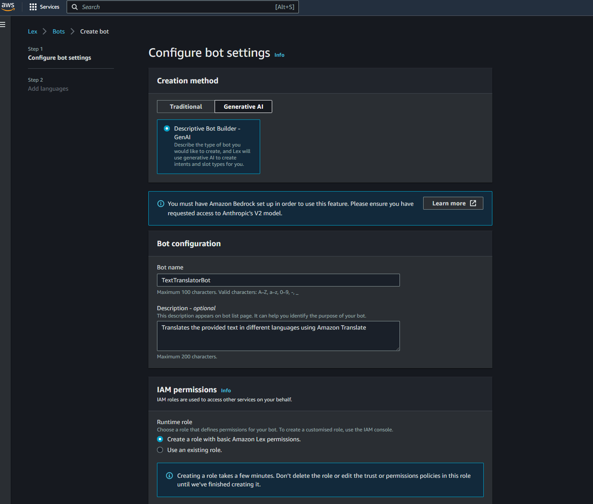

# LanguaLex – Multilingual AI Chatbot

  

## 🎯 Purpose
AI-powered chatbot that provides real-time translation across six languages using Amazon Lex for natural language processing and Amazon Translate for multilingual conversions.

## 🏗️ Architecture
- **Amazon Lex** – Conversational AI and intent recognition
- **AWS Lambda** – Serverless translation logic (Python 3.12)
- **Amazon Translate** – Multi-language translation engine
- **IAM** – Secure service-to-service authentication

## 🌍 Supported Languages
- French
- German
- Spanish
- Chinese
- Japanese
- Norwegian

## ⚙️ Technical Implementation

### Bot Configuration
Created conversational AI using Amazon Lex with intent-based dialogue flow:

### Intent & Slot Design
Implemented `BotTranslateIntent` with dynamic slot filling:
- **Language slot** – User selects target language
- **FreeFormInput slot** – Captures text to translate

### Supported Language Types

### Natural Language Utterances
Configured multiple input patterns for flexible user interaction:
- "I want to translate [text]"
- "Can you help me translate?"
- "Translate [text] to [language]"
- "Can you translate [text] into [language] for me?"

### Lambda Translation Function
Backend translation logic using Amazon Translate API:

## 🎯 Key Features
- ✅ Natural language understanding via Amazon Lex
- ✅ Real-time translation across 6 languages
- ✅ Intent-based conversation flow
- ✅ Dynamic slot filling for context-aware responses
- ✅ Serverless architecture for scalability

## 📊 Technical Highlights
- Conversational AI design with multi-turn dialogue
- Cross-service integration (Lex + Lambda + Translate)
- IAM-based security and least privilege access
- Event-driven serverless processing
- Production-ready error handling

## 🔧 Use Cases
- Customer support chatbots for international businesses
- Language learning assistance tools
- Real-time translation for global teams
- Multilingual content moderation systems

## 📈 Future Enhancements
- [ ] Additional language support (20+ languages)
- [ ] Voice input/output integration
- [ ] Context-aware translations with conversation history
- [ ] Web interface deployment
- [ ] Translation confidence scoring

---

**Built with:** Amazon Lex | AWS Lambda | Amazon Translate | Python

**Tags:** `aws` `lex` `chatbot` `translation` `lambda` `nlp` `ai` `serverless`
